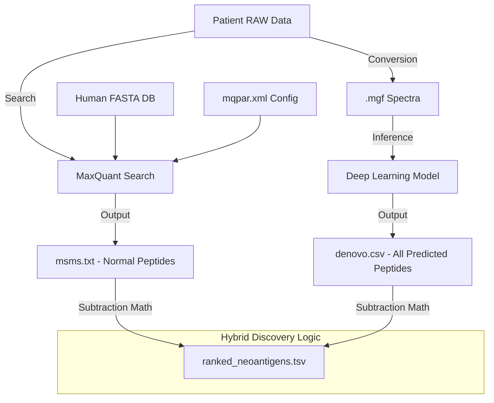

# Objective 3: Hybrid Immunopeptidomics Discovery — Detailed Fundamentals Guide

This document provides a ground-level explanation of **Objective 3**: the discovery of cancer-specific neoepitopes using a hybrid approach of database searching and deep learning.

---

## 1. The Objective: What are we trying to find?

The goal of this pipeline is to identify **Neoepitopes**.

*   **The Biology**: Every cell in your body "displays" small fragments of the proteins it is making on its surface using a "docking station" called **MHC** (Major Histocompatibility Complex).
*   **The Immune System**: Your immune system "patrols" these docks. If it sees a fragment it recognizes as "normal," it does nothing. If it sees a fragment that looks "foreign" (like a virus or a mutated cancer protein), it attacks.
*   **The Cancer Problem**: Cancer cells have "typos" in their DNA (mutations). These typos lead to "mutated" protein fragments being displayed on the surface. These are **Neoepitopes**. If we can find them, we can tell the immune system exactly which cells to kill.

---

## 2. The Problem with Standard Tools

Standard tools like **MaxQuant** are "database-dependent." 

*   They take a "Dictionary" (a FASTA file like UniProt) and try to match the experimental signals (Spectra) to words in that dictionary.
*   **The Failure**: Since neoepitopes are mutated, they are NOT in the dictionary. MaxQuant will either ignore them or misidentify them as the closest "normal" word.

---

## 3. The Hybrid Solution (Math & Logic)

To solve this, we use a **Subtraction Logic**.

### The Math:
Let:
*   $D$ = The set of all possible peptides predicted by **Deep Learning** (De Novo Sequencing). This doesn't need a dictionary; it "sounds out" the signal.
*   $M$ = The set of all "normal" peptides identified by **MaxQuant** using the human proteome dictionary.
*   $N$ = The set of potential **Neoepitopes**.

The logic is:
$$N = D \setminus M$$
*(In English: "Find everything the AI predicts that isn't a known normal protein fragment.")*

### The "Bio-Verification":
Once we have $N$, we check:
1.  **Binding Affinity**: Does this fragment actually fit into the MHC "docking station"? (We use tools like NetMHCpan for this).
2.  **Mutation Check**: Is this sequence just 1 or 2 letters different from a normal protein? (If it's completely different, it might be noise).

---

## 4. Manual Execution Walkthrough (Step-by-Step)

We performed these steps manually to ensure absolute control over the server's resources.

### Step 1: Data Preparation (The Symlink Trick)
RAW mass spec files are massive (gigabytes each). To avoid filling up the disk, we use **Symbolic Links**.
*   **Command**: `ln -s /source/path/file.raw /destination/path/file.raw`
*   **Why?**: This creates a "shortcut" instead of a copy.

### Step 2: Spectral Conversion
We convert proprietary `.raw` files into human-readable `.mgf` (Mascot Generic Format).
*   **Tool**: `ThermoRawFileParser`
*   **Manual Run**: `python3 src/conversion_pipeline.py --input data/raw --output data/mgf`

### Step 3: Database Search (The "Normal" Baseline)
We run MaxQuant to find all the normal peptides.
*   **Challenge Encountered**: MaxQuant failed because of pathing and metadata issues (`NullReferenceException`).
*   **Fix**: We patched `src/scale_search.py` to use **Absolute Paths** for the FASTA files and the RAW data.
*   **Command**: `python3 src/scale_search.py` (Runs sequentially to save memory).

### Step 4: De Novo Discovery (The AI Step)
We run our Deep Learning model to predict sequences from the `.mgf` files.
*   **Logic**: The model sees peaks at $m/z$ 110.07, 129.10, etc., and "translates" them into amino acids like `L-L-G-R`.

---

## 5. File Anatomy: What's inside each file?

To make the pipeline "crystal clear," here is exactly what each file looks like and how they are processed.

### A. The "Source": `.raw` Files
*   **Format**: Binary (Proprietary Thermo Fisher)
*   **Content**: Millions of "scans" representing ions hitting a detector.
*   **Role**: This is the raw evidence from the patient's tumor sample.
*   **How it's processed**: We cannot read this directly. We use `ThermoRawFileParser` to "unlock" it into `.mgf` for AI and `MaxQuant` to search it directly.

### B. The "Dictionary": `uniprot_human.fasta`
*   **Format**: Text (FASTA)
*   **Content**: Every known normal human protein sequence.
*   **Sample**:
```text
>sp|P02768|ALBU_HUMAN Serum albumin OS=Homo sapiens OX=9606 GN=ALB PE=1 SV=2
MKWVTFISLLFLFSSAYSRGVFRRDAHKSEVAHRFKDLGEENFKALVLIAFAQYLQQCP
FEDHVKLVNEVTEFAKTCVADESAENCDKSLHTLFGDKLCTVATLRETYGEMADCCAKQE
...
```
*   **Connection**: MaxQuant reads this to see if a signal matches a "normal" word.

### C. The "Instruction Manual": `mqpar.xml`
*   **Format**: XML
*   **Content**: 500+ parameters telling MaxQuant how to behave.
*   **Critical Samples**:
```xml
<fastaFiles>
   <FastaFileInfo>
      <fastaFilePath>/home/amity/experiments/data/reference/uniprot.fasta</fastaFilePath>
   </FastaFileInfo>
</fastaFiles>
<filePaths>
   <string>/home/amity/experiments/data/raw/sample_1.raw</string>
</filePaths>
```
*   **Note**: This is where we "patch" absolute paths to prevent `NullReferenceException`.

### D. The "AI-Ready Spectra": `.mgf` Files
*   **Format**: Text (Mascot Generic Format)
*   **Content**: The $m/z$ (mass-to-charge) and intensity of every fragment.
*   **Sample**:
```text
BEGIN IONS
TITLE=Scan_500 RT=12.5
PEPMASS=488.23  # Total mass of the peptide
72.04 1500.2    # Fragment peak (Mass, Intensity)
86.06 8900.5    # Another fragment peak
END IONS
```
*   **Processing**: The Deep Learning model reads these peaks and predicts letters (e.g., `86.06` -> Leucine).

### E. The "Database Result": `msms.txt` (from MaxQuant)
*   **Format**: Tab-Separated (TSV)
*   **Content**: The list of "Normal" identifications.
*   **Sample**:
```text
Sequence	m/z	Score	Proteins	Experiment
LLGRNSFEV	450.23	120.5	ALBU_HUMAN	Sample_1
TYRPAAAL	380.12	95.2	KERATIN_H	Sample_1
```
*   **Connection**: This is our "Blacklist." If a sequence is here, it is NOT a neoepitope.

---

## 6. Pipeline Flow & Lineage

Here is how the data flows through the system:



---

## 7. The Math: How "Discovery" Happens

### 1. The Mass Delta ($ \Delta m $)
The machine measures the mass of a peptide. If the AI predicts a sequence but the mass doesn't match the database, we calculate:
$$ \Delta m = | \text{Mass}_{\text{Experimental}} - \text{Mass}_{\text{Predicted}} | $$
If $\Delta m$ is near zero, the prediction is chemically valid.

### 2. The Confidence Score ($ P $)
The Deep Learning model outputs a probability for every amino acid:
$$ P(\text{Sequence}) = \prod_{i=1}^{L} P(AA_i) $$
We only keep candidates where the total confidence is $> 90\%$.

### 3. The Subtraction (The Final Step)
$$ \text{Neoepitopes} = \{ s \in \text{DeNovo} \mid s \notin \text{Database} \land \text{IsBinding}(s, \text{HLA}) \} $$

---

## 8. Sample Final Result: `ranked_neoantigens.tsv`

This is the final file you get at the end of the project:

| Peptide | Prediction Score | DB Match? | HLA Binding (nM) | Rank |
| :--- | :--- | :--- | :--- | :--- |
| **SLYNTVATL** | 0.98 | **NO** (Novel) | 15.2 (Strong) | **1** |
| **VLDGLGLAV** | 0.95 | **NO** (Novel) | 45.0 (Strong) | **2** |
| **LLGRNSFEV** | 0.92 | **YES** (Normal) | -- (Filtered) | **--** |

---

## 9. Critical Technical Notes

1.  **Absolute Paths**: MaxQuant (C#) cannot resolve relative paths like `../data`. You must use `/home/amity/...` everywhere.
2.  **Sequential Processing**: We use a `for` loop in Python to run MaxQuant one sample at a time. This prevents the server from running out of RAM (OOM).
3.  **The "Skip" Logic**: Our code checks if `msms.txt` already exists for a sample. If it does, it skips it. This is why you can stop and start the pipeline safely.

---
**Summary**: We take "Raw Noise" (.raw), convert it to "Peaks" (.mgf), check the "Dictionary" (.fasta), use "AI" (DL), and then "Subtract" to find the "Cancer Signature."
