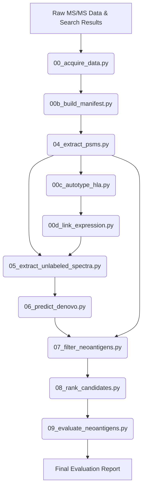

# In-Depth Scientific & Computational Methodology: Autonomous Neoepitope Discovery Pipeline

## 1. Ground-Level Concepts & Overview

### 1.1 Understanding Mass Spectrometry-Based Immunopeptidomics
Immunopeptidomics involves the isolation and identification of peptides presented by Major Histocompatibility Complex (MHC) class I molecules on the cell surface. 
1. **Sample Preparation**: Cells or tissues are lysed, and MHC-peptide complexes are purified using affinity chromatography (e.g., with anti-MHC antibodies). The peptides are then eluted from the MHC molecules.
2. **Liquid Chromatography-Tandem Mass Spectrometry (LC-MS/MS)**: The eluted peptides are separated by liquid chromatography and injected into a mass spectrometer. 
   - **MS1 scan**: The instrument measures the mass-to-charge ratio ($m/z$) and abundance of intact precursor ions.
   - **MS2 scan (Fragmentation)**: Selected precursor ions are isolated and fragmented (typically by Collision-Induced Dissociation [CID] or Higher-energy Collisional Dissociation [HCD]) into product ions. The instrument records the intensity and $m/z$ of these fragment ions, producing an MS/MS spectrum.

### 1.2 Database Searching vs. De Novo Sequencing
- **Database Searching**: Standard search engines (e.g., MaxQuant, Mascot, Sequest) compare the observed fragment ion peaks in an MS/MS spectrum against the theoretical fragmentation patterns of peptides in a reference database (such as UniProt). If the peaks match with high confidence, a Peptide-Spectrum Match (PSM) is recorded.
- **The Neoepitope Challenge**: Standard databases only contain wild-type (normal) sequences. Tumor-specific mutations (neoepitopes) are absent. While one could append mutated sequences to the database, this leads to:
  - **Database Bloat**: Appending all potential mutations (including single-point mutations, frame-shifts, insertions, and deletions) exponentially increases the database size.
  - **False Discovery Rate (FDR) Inflation**: A larger search space increases the likelihood of random false-positive matches, requiring more stringent score thresholds and reducing sensitivity.
- **De Novo Peptide Sequencing**: Instead of matching spectra to a predefined database, de novo sequencing directly decodes the amino acid sequence from the mass differences between fragment ion peaks (e.g., the $b$-ion and $y$-ion series). This pipeline uses a Deep Learning architecture (CNN-LSTM) to perform de novo sequencing on spectra that remain unmatched by database searches, allowing the identification of novel, mutated peptides.

---

## 2. Normal vs. Mutated Peptides: Definition, Extraction, and Roles

A clear distinction between "Normal" (wild-type, self-peptides) and "Mutated" (neoepitope candidate) peptides is central to this pipeline. The table below details their definition, source, and exact roles across the computational workflow.

| Feature / Role | Normal Peptides (Wild-Type Baseline) | Mutated Peptides (Neoepitope Candidates) |
| :--- | :--- | :--- |
| **Definition** | Peptides present in the normal human proteome that are processed and presented by MHC molecules. | Tumor-specific peptides containing somatic mutations (e.g., single amino acid substitutions) presented by MHC molecules. |
| **Source in Pipeline** | Identified by standard database searches (e.g., MaxQuant) of patient MS/MS spectra against UniProt. | Predicted *de novo* from unmatched/unlabeled spectra and validated via sequence alignment. |
| **Spectral Extraction** | Corresponding spectra are flagged as "labeled" in `04_extract_psms.py` and excluded from further de novo search. | Spectra that fail to match any normal peptide are compiled into `unlabeled_only.mgf` in `05_extract_unlabeled_spectra.py`. |
| **Model Calibration / Fine-Tuning** | Used in `05_train_denovo_model.py` to train/fine-tune the CNN-LSTM. It teaches the model instrument-specific fragmentation biases and noise profiles. | Not used in model training to prevent overfitting to wild-type distributions. |
| **Levenshtein Distance Filter** | Acts as the reference library. Every candidate peptide is compared against these sequences. | Candidate sequences must have a Levenshtein distance of exactly 1 from a normal peptide (missense mutation). |
| **Final Validation Checks** | The parent gene corresponding to the normal wild-type peptide is checked in the RNA-seq database to verify it is actively transcribed. | Evaluated for binding affinity against the patient's HLA alleles using MHCflurry in `08_rank_candidates.py`. |

---

## 3. Step-by-Step Pipeline Walkthrough

The pipeline consists of a sequence of automated scripts orchestrated by `run_pipeline.sh`. The diagram below illustrates the flow of data and execution:

### Step 1: Smart Data Acquisition
- **Script**: `src/data_prep/00_acquire_data.py` (also references `01_download_pride.py` and `02_convert_raw_to_mgf.py`)
- **Inputs**: 
  - PRIDE Accession ID (e.g., `PXD005231`) or path to local raw files.
- **Execution Logic**:
  - Automatically queries public repositories (PRIDE or EGA) to fetch mass spectrometry RAW files and corresponding database search results (e.g., MaxQuant output).
  - Handles network interruptions with automatic resumption and validates file integrity (MD5 checksums).
- **Outputs**:
  - Raw binary files (`.raw`) saved in `data/raw/`.
  - MaxQuant identification directories (containing `msms.txt`) saved in `data/psms/`.

### Step 2: Build Sample Manifest
- **Script**: `src/data_prep/00b_build_manifest.py`
- **Inputs**:
  - `data/raw/` directory structure and metadata.
- **Execution Logic**:
  - Scans the downloaded data to map raw files (`run_id`) to individual clinical subjects (`patient_id`).
  - Standardizes patient metadata (e.g., cohort, clinical response) and initializes HLA allele placeholders.
- **Outputs**:
  - `configs/sample_manifest.tsv` (columns: `patient_id`, `run_id`, `hla_alleles`, `hla_source`, `rna_expr_path`).

### Step 3: Extract Baseline PSMs (Normal Peptide Identification)
- **Script**: `src/data_prep/04_extract_psms.py`
- **Inputs**:
  - `data/psms/` (MaxQuant directory containing `msms.txt`).
  - `configs/sample_manifest.tsv`.
- **Execution Logic**:
  - Parses the search engine output (`msms.txt`) to extract Peptide-Spectrum Matches (PSMs) that confidently represent normal (wild-type) peptides.
  - **Strict Filters Applied**:
    - **Posterior Error Probability (PEP) $\le$ 0.01**: Filters out low-confidence matches. PEP is the probability that a given PSM is a false positive.
    - **Peptide Length**: Restricted to 8–11 amino acids (the canonical length of MHC Class I binders).
    - **Decoy Exclusion**: Excludes reverse/scrambled decoy sequences (marked with `+` in MaxQuant).
- **Outputs**:
  - `results/immunopeptidome_psms.tsv` (columns: `sample_id`, `run_id`, `spectrum_id`, `peptide`, `score`).

### Step 4: Patient-Specific HLA Auto-Typing
- **Script**: `src/data_prep/00c_autotype_hla.py`
- **Inputs**:
  - `configs/sample_manifest.tsv`.
  - `results/immunopeptidome_psms.tsv`.
- **Execution Logic**:
  - Identifies patients with missing HLA alleles (`TBD`).
  - Extracts the patient's normal peptides from the PSM file.
  - **HLA Prediction Algorithm**:
    - If GibbsCluster is installed, runs spatial sequence clustering to identify consensus binding motifs.
    - Runs an MHCflurry-based enrichment search across a pool of common HLA alleles (`COMMON_ALLELES`).
    - **Enrichment Score Calculation**: For each candidate HLA allele, the script predicts the binding affinity of the patient's normal peptides. The enrichment score is the fraction of peptides with an MHCflurry percentile rank $\le 2.0\%$ (strong binding signature).
    - The top 2 alleles per locus (HLA-A, B, C) showing a binding fraction $> 0.05$ (at least 5% of peptides bind) are selected.
- **Outputs**:
  - Updated `configs/sample_manifest.tsv` containing the inferred HLA alleles (e.g., `HLA-A*02:01,HLA-B*07:02`).

### Step 5: Expression Linking
- **Script**: `src/data_prep/00d_link_expression.py`
- **Inputs**:
  - `configs/sample_manifest.tsv`.
  - Reference proteome FASTA file (e.g., `data/reference/uniprot_human_reviewed.fasta`).
- **Execution Logic**:
  - Maps patient IDs to their respective RNA-seq expression profiles (TPM).
  - **Fallback Mock Generator**: If external RNA-seq data is missing, the script extracts UniProt IDs from the reference FASTA and generates a simulated expression profile. It uses a log-normal distribution ($\mu = 0.5, \sigma = 1.2$) to model typical cellular transcription, randomly setting 10% of genes to high expression levels ($10.0 - 500.0$ TPM) to simulate active genes.
- **Outputs**:
  - Patient-specific expression files in `data/expression/` (e.g., `data/expression/Patient1_tpm.tsv`).
  - Updated `configs/sample_manifest.tsv` with paths to the expression profiles.

### Step 6: Spectral Subtraction (Isolating Unlabeled Spectra)
- **Script**: `src/data_prep/05_extract_unlabeled_spectra.py`
- **Inputs**:
  - Raw spectral files in MGF format (`data/mgf/`).
  - Filtered baseline PSMs (`results/immunopeptidome_psms.tsv`).
- **Execution Logic**:
  - Reads all raw spectra from the MGF files.
  - Compares the `run_id` and `scan_id` of each spectrum against the database of identified normal PSMs.
  - **Subtraction**: If a spectrum matches a normal PSM, it is discarded. If it has no match, it is written to the output MGF. This isolates spectra that cannot be explained by wild-type peptides, which may contain mutated neoepitopes.
- **Outputs**:
  - `data/mgf_unlabeled/*_unlabeled.mgf`.

### Step 7: CNN-LSTM De Novo Sequencing
- **Script**: `src/inference/06_predict_denovo.py` (model trained via `src/training/05_train_denovo_model.py`)
- **Inputs**:
  - Model checkpoint (`results/checkpoints/neoepitope_production_best.pth`).
  - Unlabeled spectra (`data/mgf_unlabeled/`).
- **Deep Learning Architecture (`src/cnnlstm/cnnlstm_model.py`)**:
  - **Data Representation**: Raw spectra are binned into fixed-size 1D tensors. With a bin size of 0.1 Da and maximum $m/z$ of 2000.0, each spectrum is represented as a vector of length 20,000. The intensity values are normalized relative to the base peak (highest intensity = 1.0).
  - **CNN Encoder**: Processes the 1D spectrum vector through convolutional layers (1D convolutions, batch normalization, ReLU activation, max pooling). This extracts spatial correlations representing fragmentation ladders ($b$ and $y$ ions).
  - **LSTM Decoder**: An adaptive average pooling layer resizes the CNN feature map to a sequence length of 30. A Bi-Directional LSTM processes this sequence, and a final fully connected layer outputs a probability distribution over the amino acid vocabulary at each position.
  - **Transfer Learning Calibration**: The model is fine-tuned on the sample-specific normal baseline PSMs before inference. This calibrates the neural network to the fragmentation energy, mass accuracy, and noise profile of the specific instrument run.
- **Outputs**:
  - `results/de_novo_candidates.tsv` (containing predicted sequences and their de novo confidence scores).

### Step 8: Multi-Stage Filtering & Quality Control
- **Script**: `src/postprocess/07_filter_neoantigens.py`
- **Inputs**:
  - `results/de_novo_candidates.tsv`.
  - `results/immunopeptidome_psms.tsv` (baseline PSMs).
  - Reference proteome (`data/reference/uniprot_human_reviewed.fasta`).
- **Execution Logic**:
  - **Score Filter**: Retains predicted peptides with a de novo confidence score $\ge 0.7$.
  - **Length Filter**: Retains sequences with a length of 8–11 amino acids.
  - **Database Subtraction**: Discards any predicted sequence that matches a baseline normal peptide from the current patient.
  - **Scan Support**: Retains sequences identified in $\ge 2$ independent MS/MS scans to filter out transient noise.
  - **Missense Mutation Verification**: 
    - Indexes all possible 8–11-mer peptides in the human proteome FASTA.
    - Performs an alignment check (Levenshtein distance = 1). The predicted peptide must differ by exactly one amino acid substitution from a reference human peptide.
    - **Flanking Position Filter**: Substitutions at position 1 or the carboxyl-terminal position are excluded by default (unless `--allow-flanking-mutations` is set), as flanking mutations often alter proteasomal cleavage rather than TCR recognition.
- **Outputs**:
  - `results/filtered_neoantigens.tsv` (including mutation details: wild-type sequence, substitution position, wild-type amino acid, mutant amino acid, and source protein ID).

### Step 9: MHC Binding and Expression Ranking
- **Script**: `src/postprocess/08_rank_candidates.py`
- **Inputs**:
  - `results/filtered_neoantigens.tsv`.
  - `configs/sample_manifest.tsv`.
- **Execution Logic**:
  - **MHC Binding Affinity**: Predicts the binding affinity of the mutated peptides against the patient's HLA alleles using MHCflurry. Candidates must achieve a percentile rank $\le 2.0\%$ (representing the top 2% of strongest binders).
  - **Expression Validation**: Matches the source protein of the mutated peptide to the patient's RNA-seq expression file. The parent gene must have an expression level $\ge 1.0$ TPM.
  - **Evidence Classification**:
    - **Class A**: Missense mutation + binding rank $\le 2.0\%$ + expression $\ge 1.0$ TPM.
    - **Class B**: Other mutation type + binding rank $\le 2.0\%$ + expression $\ge 1.0$ TPM.
    - **Class C**: Fails to meet one or more criteria.
- **Outputs**:
  - `results/ranked_neoantigens.tsv` (sorted by evidence class and binding rank).

### Step 10: Validation & Benchmarking
- **Script**: `src/evaluation/09_evaluate_neoantigens.py`
- **Inputs**:
  - `results/ranked_neoantigens.tsv`.
  - Validated reference list (e.g., `data/reference/s2_dataset_extracted/Dataset1/Dataset1.txt` from Bassani-Sternberg 2016).
  - `configs/sample_manifest.tsv`.
- **Execution Logic**:
  - Loads the validated peptides detected in the benchmark study. A peptide is considered detected in a patient if its MS intensity in the dataset is $> 0$.
  - Computes **Precision** and **Recall** at different top-N cutoffs (e.g., Top-10, Top-25, Top-50 ranked candidates).
    - $\text{Precision@N} = \frac{\text{True Positives in Top-N}}{N}$
    - $\text{Recall@N} = \frac{\text{True Positives in Top-N}}{\text{Total Validated Peptides for Patient}}$
- **Outputs**:
  - `results/evaluation_report.md` (summarizing pipeline performance per patient and listing the top candidate neoepitopes).
