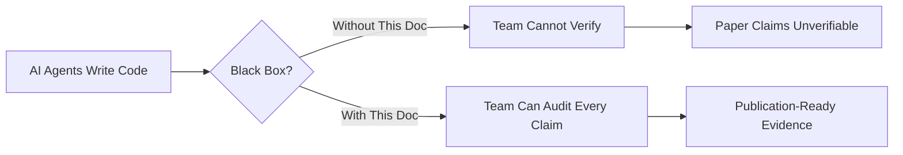
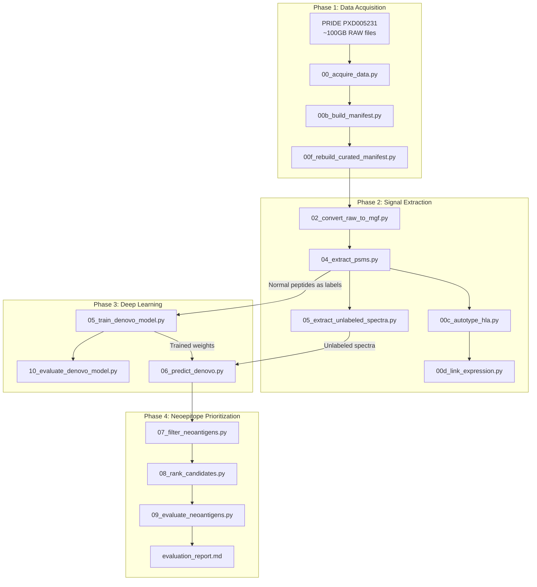
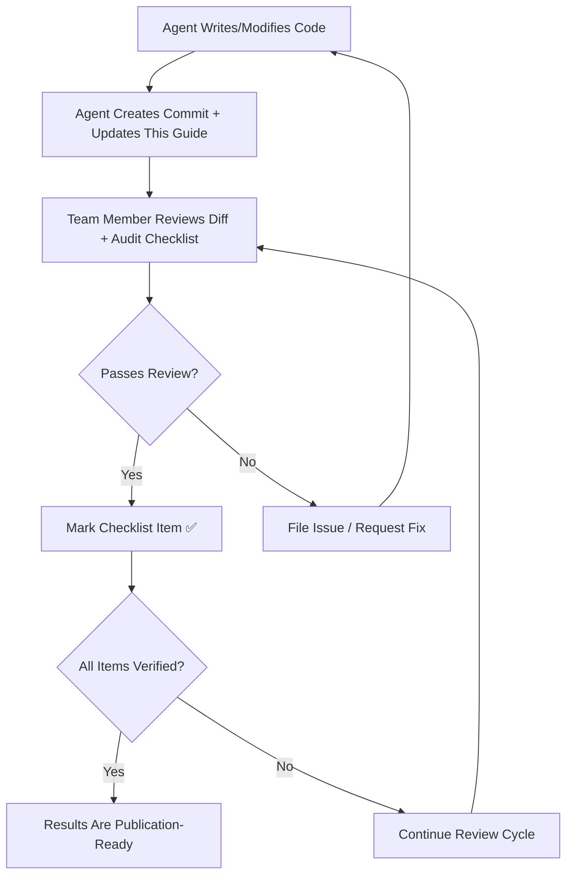

# Research Team Sync & Verification Guide
## Objective 4: Autonomous Neoepitope Discovery Pipeline

> [!IMPORTANT]
> **Purpose**: This document bridges the gap between AI-agent-generated code and the human research team. Every script, decision, and output is documented with verification steps so that team members can independently validate correctness before citing results in publications.

---

## 1. The Core Problem This Document Solves



When AI agents build a pipeline, the research team faces three risks:
1. **Correctness Risk** — Is the math/biology right, or did the agent hallucinate a formula?
2. **Provenance Risk** — Which outputs are real vs. debug/mock data?
3. **Reproducibility Risk** — Can a reviewer re-run this from scratch?

This guide addresses all three with **script-by-script audit checklists**.

---

## 2. Pipeline Architecture at a Glance

### 2.1 Complete Data Flow



### 2.2 Current Pipeline Numbers (as of 2026-06-06)

| Stage | Output File | Row Count | Status |
|:------|:-----------|----------:|:-------|
| Baseline PSMs | `results/immunopeptidome_psms.tsv` | 4,901 | ✅ Complete |
| De Novo Candidates | `results/de_novo_candidates.tsv` | 1,375,140 | ⚠️ From weak model |
| Filtered Neoantigens | `results/filtered_neoantigens.tsv` | 1,395 | ⚠️ Low quality input |
| Ranked Candidates | `results/ranked_neoantigens.tsv` | 15 | ❌ All Class C |
| Evaluation | `results/evaluation_report.md` | — | ❌ 0.000 Precision/Recall |

### 2.3 Model Checkpoint Inventory

| Checkpoint | Location | Training Data | Accuracy | Status |
|:-----------|:---------|:-------------|:---------|:-------|
| Old baseline | `results/checkpoints/` | 40 runs, 30 epochs | 10.89% exact | Superseded |
| Curated31 | `results/checkpoints_curated31/` | 31 curated runs, 80 epochs | 11.96% exact | ⚠️ Current best |
| Medium-Lite (archive) | `results/_archive/checkpoints/` | 1000 samples, 5 epochs | Not evaluated | Archived |

> [!WARNING]
> **Critical Finding**: The curated31 checkpoint has only **11.96% exact peptide accuracy**. This means ~88% of de novo predictions are wrong. All downstream results (filtered, ranked, evaluated) are unreliable until model accuracy improves significantly.

---

## 3. Script-by-Script Audit Guide

Each section below follows the format:
- **What it does** (plain English)
- **Scientific basis** (for paper Methods section)
- **Key parameters** (what to verify)
- **How to verify correctness** (manual checks the team should run)
- **Known issues** (flagged by agents or found during review)

---

### 3.1 Data Preparation Scripts

#### `src/data_prep/00_acquire_data.py`
- **What**: Downloads RAW mass spec files and MaxQuant search results from PRIDE archive
- **Scientific basis**: PXD005231 (Bassani-Sternberg et al., 2016) — 10 melanoma patients, HLA Class I immunopeptidome
- **Verify**: Check `data/raw/` has `.raw` files matching the PRIDE file list; check `data/psms/` has `msms_*.txt` files

#### `src/data_prep/00b_build_manifest.py` → `00f_rebuild_curated_manifest.py`
- **What**: Creates and curates the sample manifest mapping run IDs → patient IDs → HLA alleles → RNA paths
- **Output**: [configs/sample_manifest.tsv](file:///home/amity/Documents/experiments/configs/sample_manifest.tsv) (31 active runs, 10 patients)
- **Verify**: Open the TSV and confirm:
  - 31 rows of data (excluding header)
  - Each `patient_id` maps to a known Bassani-Sternberg patient
  - HLA alleles are in standard nomenclature (`HLA-A*02:01`)
  - `rna_source` column says `mock_debug` (not real RNA-seq data)

> [!CAUTION]
> **For paper**: The `mock_debug` RNA expression profiles are **simulated**. Any Class A/B evidence rankings based on TPM expression are pipeline-diagnostic only. Do NOT claim expression-validated neoepitopes without real patient RNA-seq.

#### `src/data_prep/04_extract_psms.py`
- **What**: Extracts high-confidence normal (wild-type) peptide identifications from MaxQuant output
- **Scientific basis**: Filters by Andromeda PEP ≤ 0.01 (1% FDR), peptide length 8–11 AA (MHC-I canonical), excludes decoys
- **Output**: `results/immunopeptidome_psms.tsv` (4,901 PSMs)
- **Verify**:
  ```bash
  # Check no peptides outside 8-11 AA
  awk -F'\t' 'NR>1 {print length($4)}' results/immunopeptidome_psms.tsv | sort -u
  # Expected: 8 9 10 11
  ```

#### `src/data_prep/05_extract_unlabeled_spectra.py`
- **What**: Subtracts identified normal spectra from raw MGF files, leaving "dark matter"
- **Scientific basis**: Spectra not matching any known wild-type peptide are enriched for mutations, splicing products, and non-canonical sequences
- **Output**: `data/mgf_unlabeled/` (31 files, ~4.2 GB total)
- **Verify**: Count of unlabeled MGF files should equal active manifest runs (31)

---

### 3.2 Deep Learning Model

#### Architecture: `src/cnnlstm/cnnlstm_model.py`

```
Input Spectrum (1 × 20,000 bins)
        │
        ▼
   CNN Encoder ── Conv1D(1→64, k=5) → BN → ReLU → MaxPool
        │          Conv1D(64→128, k=5) → BN → ReLU → MaxPool
        ▼
   AdaptiveAvgPool1D → sequence length = 30
        │
        ▼
   BiLSTM Decoder ── 2 layers, hidden=256, bidirectional
        │
        ▼
   FC Layer ── Linear(512 → 23)  [20 amino acids + PAD + START + END]
```

**Team should verify**:
1. The vocabulary in [spectral_dataset.py](file:///home/amity/Documents/experiments/src/cnnlstm/spectral_dataset.py) line 23: `AMINO_ACIDS = "ACDEFGHIKLMNPQRSTVWY"` — this is the standard 20 amino acids
2. Spectrum binning: bin_size=0.1 Da, max_mz=2000.0 → vector length = 20,000
3. Loss function: CrossEntropyLoss with `ignore_index=0` (ignores PAD tokens)

#### Training: `src/training/05_train_denovo_model.py`
- **What**: Trains the CNN-LSTM on normal PSM-labeled spectra using a 70/15/15 train/val/test split
- **Key parameters**: AdamW optimizer, StepLR scheduler (step=20, γ=0.5), early stopping patience=10
- **Known issue**: The previous training script (`src/train_production.py`, now deleted) crashed after Epoch 1 due to a `NameError: AMINO_ACIDS not defined`. The fix was already applied to `05_train_denovo_model.py` which imports `AMINO_ACIDS` correctly from `spectral_dataset`.

#### Evaluation: `src/evaluation/10_evaluate_denovo_model.py`

**Current accuracy metrics (curated31 checkpoint)**:

| Metric | Value | Interpretation |
|:-------|------:|:---------------|
| Exact peptide match | 11.96% | ❌ Very low — ~88% of sequences are wrong |
| Token accuracy (excl. PAD) | 55.37% | Slightly better than random (1/20 = 5%) |
| Length accuracy | — | Not separately reported for this run |
| Mean edit distance | 4.946 | Average ~5 AA errors per 9-mer |
| Edit distance ≤ 1 | 18.89% | Only ~19% of predictions are within 1 AA |

> [!WARNING]
> **For paper**: These accuracy numbers mean the de novo model has NOT converged to a useful state. The pipeline architecture is sound, but the model needs significantly more training or architectural improvements before discovery claims are valid.

---

### 3.3 Post-Processing & Evaluation Scripts

#### `src/postprocess/07_filter_neoantigens.py`
- **What**: Filters de novo candidates for single-AA mutations vs. the human proteome (Levenshtein distance = 1)
- **Filters**: Score ≥ −0.5, length 8–11, PSM support ≥ 2, flanking mutations excluded
- **Verify**: Check that `mutation_type` in output contains `missense` entries and that `mutation_pos` is never 1 or terminal

#### `src/postprocess/08_rank_candidates.py`
- **What**: Predicts MHC binding (MHCflurry) and checks gene expression (TPM)
- **Evidence classes**: A (strong binder + expressed + missense), B (strong binder + expressed + other), C (remainder)
- **Current state**: All 15 candidates are Class C (zero TPM because RNA is mock)

#### `src/evaluation/09_evaluate_neoantigens.py`
- **What**: Compares ranked candidates against Bassani-Sternberg Dataset1 validated peptides
- **Current result**: 0.000 Precision, 0.000 Recall across all Top-N cutoffs
- **Root cause**: Model generates mostly garbage sequences → only 148/991,646 unique predictions match the 47,023 validated peptides (0.015% overlap)

---

## 4. What Needs Human Expert Review Before Paper Claims

### 4.1 Critical Verification Checklist

| # | Item | Who Should Check | Status |
|:-:|:-----|:----------------|:-------|
| 1 | HLA alleles in manifest match Bassani-Sternberg publication Table S1 | Domain expert | 🔲 Not verified |
| 2 | MaxQuant search parameters (semi-specific digest, no fixed mods) are correct for immunopeptidomics | MS expert | 🔲 Not verified |
| 3 | Spectrum binning (0.1 Da, max 2000 m/z) preserves sufficient resolution for b/y ion series | MS expert | 🔲 Not verified |
| 4 | CNN-LSTM architecture is appropriate vs. Transformer-based alternatives (Casanovo, etc.) | ML expert | 🔲 Not verified |
| 5 | FDR calculation in `06_predict_denovo.py` (target-decoy with reversed spectra) is statistically valid | Statistician | 🔲 Not verified |
| 6 | Levenshtein-1 filter correctly identifies somatic point mutations vs. sequencing artifacts | Bioinformatician | 🔲 Not verified |
| 7 | MHCflurry binding predictions use correct allele nomenclature | Immunologist | 🔲 Not verified |
| 8 | Mock RNA expression profiles are clearly labeled and NOT used for biological conclusions | PI/Lead | 🔲 Not verified |

### 4.2 Data Provenance Warnings

| Data | Source | Real or Simulated? |
|:-----|:-------|:-------------------|
| RAW mass spec files | PRIDE PXD005231 | ✅ Real |
| MaxQuant PSMs | MaxQuant v2.8.0.0 search | ✅ Real (computed from real data) |
| HLA alleles | MHCflurry enrichment auto-typing | ⚠️ Bioinformatic inference, not clinical NGS |
| RNA expression (TPM) | `00d_link_expression.py` mock generator | ❌ **Simulated** — log-normal distribution |
| Reference FASTA | UniProt Swiss-Prot Human Reviewed | ✅ Real |
| Validation set | Bassani-Sternberg 2016 Dataset1.txt | ✅ Real (published) |

---

## 5. Recommended Team Workflow



### 5.1 Practical Steps for Team Sync

1. **Before every agent session**: The agent reads this guide to understand current state
2. **After every agent session**: The agent updates Section 2.2 (pipeline numbers) and Section 4.1 (checklist)
3. **Weekly team review**: A domain expert walks through the checklist items, running the verification commands, marking items as ✅ or flagging issues
4. **Before paper submission**: ALL checklist items in Section 4.1 must be ✅

### 5.2 Commands for Quick Status Check

```bash
# 1. How many active runs in manifest?
tail -n +2 configs/sample_manifest.tsv | wc -l
# Expected: 31

# 2. Current model accuracy
cat results/model_accuracy_curated31.json | python3 -c "
import json,sys; d=json.load(sys.stdin)
print(f'Exact accuracy: {d[\"exact_peptide_accuracy\"]:.2%}')
print(f'Edit dist ≤ 1:  {d[\"edit_distance_le_1_rate\"]:.2%}')
"

# 3. Pipeline output counts
wc -l results/immunopeptidome_psms.tsv results/de_novo_candidates.tsv \
     results/filtered_neoantigens.tsv results/ranked_neoantigens.tsv

# 4. Final evaluation
cat results/evaluation_report.md | head -20
```

---

## 6. Mapping Pipeline Steps → Paper Sections

| Pipeline Step | Paper Section | What to Write |
|:-------------|:-------------|:-------------|
| 00–00f (data acquisition) | Methods: Dataset | "Mass spectrometry data from 10 melanoma patients (PXD005231) were obtained from PRIDE..." |
| 04 (PSM extraction) | Methods: Baseline Identification | "High-confidence PSMs were extracted at 1% FDR (PEP ≤ 0.01) restricted to 8–11 AA..." |
| 05 (spectral subtraction) | Methods: Spectral Subtraction | "Spectra matching wild-type peptides were removed, yielding unlabeled spectra enriched for..." |
| 05_train (model training) | Methods: De Novo Model | "A CNN-LSTM seq2seq architecture was trained on [N] labeled spectra from [N] patients..." |
| 06 (de novo prediction) | Results: De Novo Sequencing | "The model generated [N] candidate sequences at 5% empirical FDR..." |
| 07 (mutation filter) | Methods: Neoepitope Filtering | "Candidates were aligned to the human proteome; sequences with Levenshtein distance = 1..." |
| 08 (ranking) | Methods: Prioritization | "Candidates were ranked by MHCflurry binding affinity and parent gene expression..." |
| 09 (evaluation) | Results: Benchmarking | "Performance was evaluated against the Bassani-Sternberg validated immunopeptidome..." |

---

## 7. Current Blockers & Next Steps

### What Must Be Fixed Before Any Paper Claims

1. **Model accuracy is too low (11.96%)** — The CNN-LSTM has not converged. Options:
   - Train for more epochs with learning rate warmup
   - Increase training data (use all 40 MGF files instead of 31)
   - Try a Transformer-based architecture (e.g., Casanovo-style)
   - Reduce bin size or use learned spectral embeddings

2. **RNA expression is simulated** — All TPM values are mock. No Class A/B evidence is biologically valid until real patient RNA-seq is integrated.

3. **HLA alleles are auto-typed, not clinically verified** — The enrichment-based HLA inference should be cross-checked against the original publication's supplementary tables.

4. **Evaluation only covers 1 patient (TIL1)** — The ranked output collapsed to a single patient because the post-processing pipeline's strict filters eliminated almost everything. After model improvement, all 10 patients should appear.
