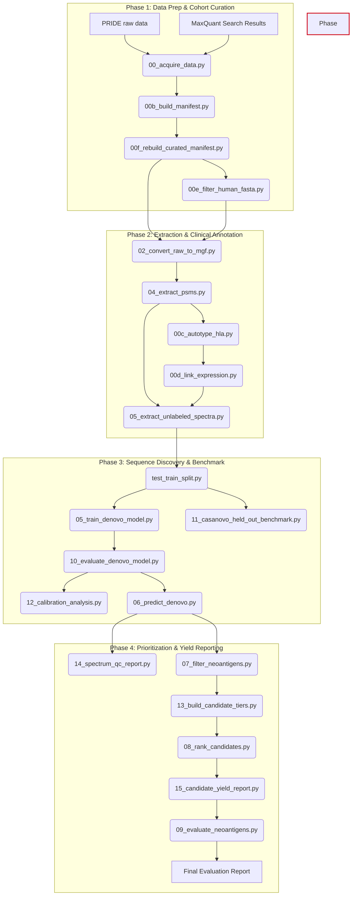

# Executive & Technical Manual: Autonomous Neoepitope Discovery Pipeline

This document serves as the comprehensive manual and execution guide for the **Objective 3 & 4 Neoepitope Discovery Pipeline**. It outlines the chronological steps, script architectures, file flows, mathematical justifications, and biological rationales underlying each stage of the pipeline.

---

## 1. Pipeline Architectural Overview

The core objective of the pipeline is the **high-throughput identification of mutated immunogenic peptides (neoepitopes) from mass spectrometry (MS) raw clinical samples for personalized cancer vaccines**. 

This pipeline embraces a **Personalized DeepNovo philosophy**: it trains a custom CNN-LSTM model on a patient's own identified HLA peptidome, learning their specific fragmentation and presentation biases, and then uses that model to predict neoantigens from the unassigned "dark matter" spectra of those identical LC-MS/MS runs.

### Overall Workflow Diagram



---

## 2. Core Scientific & Computational Concepts

### 2.1 MS-Based Immunopeptidomics
Cells present peptides derived from intracellular proteins on their surfaces via MHC Class I molecules. These peptides are harvested, purified via affinity chromatography, and analyzed using **Liquid Chromatography-Tandem Mass Spectrometry (LC-MS/MS)**.
*   **MS1 Spectra**: Measures the mass-to-charge ($m/z$) ratio and intensity of intact precursor peptides.
*   **MS2 Spectra**: Measures the fragmentation peak patterns of a selected peptide. In MS2, collision energy breaks peptide bonds, yielding amino acid fragments (primarily $b$-ions and $y$-ions).

### 2.2 Database Search vs. De Novo Sequencing
*   **Database Search (MaxQuant/Andromeda)**: Compares MS2 patterns against a theoretical database (e.g., human UniProt). It is highly accurate for normal, wild-type self-peptides but cannot identify mutations absent from the database.
*   **De Novo Sequencing**: Directly reads the amino acid sequence from the mass distance between consecutive peaks in an MS2 spectrum (e.g., $113.08$ Da = Leucine/Isoleucine). It is the only way to discover novel, mutated sequences without database bloat or FDR inflation.

### 2.3 Spectral Subtraction
By subtracting all spectra that match normal, wild-type peptides with high confidence (Andromeda PEP $\le 0.01$), we isolate the **"dark matter" of the immunopeptidome**. These remaining unlabeled spectra are enriched for mutated peptides, peptide splicing events, and non-canonical transcripts.

---

## 3. Step-by-Step Execution Sequence

### Phase 1: Data Acquisition & Cohort Curation

#### Step 00: Smart Data Acquisition
*   **Script**: `src/data_prep/00_acquire_data.py` (Helper: `01_download_pride.py`)
*   **Input**: PRIDE Accession ID (`PXD005231`) or local directories.
*   **Output**: Raw Thermo instrument binary files (`data/raw/*.raw`) and MaxQuant identification files (`data/psms/*_msms.txt`).
*   **Detailed Function**: Queries public repository metadata, initiates multi-threaded file downloads, performs MD5 validation, and skips files already present to conserve bandwidth.
*   **Command**:
    ```bash
    python3 src/data_prep/00_acquire_data.py --accession PXD005231 --raw-dir data/raw --psm-dir data/psms
    ```

#### Step 00b & 00f: Build and Curate Manifest
*   **Script**: `src/data_prep/00f_rebuild_curated_manifest.py`
*   **Output**: A finalized, cleaned `configs/sample_manifest.tsv` (31 active runs) mapping raw identifiers to clinical patient blocks.

#### Step 00e: Filter Human FASTA
*   **Script**: `src/data_prep/00e_filter_human_fasta.py`
*   **Output**: `data/reference/uniprot_human_reviewed.only_human.fasta`.
*   **Why**: Restricts the search space to human reference proteins, preventing false alignments during downstream somatic mutation validation.

---

### Phase 2: Extraction & Clinical Annotation

#### Step 02: RAW to MGF Signal Conversion
*   **Script**: `src/data_prep/02_convert_raw_to_mgf.py`
*   **Output**: Standard Mascot Generic Format text peak lists (`data/mgf/*.mgf`).

#### Step 04: Extract Baseline PSMs
*   **Script**: `src/data_prep/04_extract_psms.py`
*   **Output**: `results/immunopeptidome_psms.tsv` (normal peptide database).
*   **Why**: Compiles the patient's normal, wild-type immunopeptidome profile.

#### Step 00c: Bioinformatic HLA Auto-Typing
*   **Script**: `src/data_prep/00c_autotype_hla.py`
*   **Output**: Updated manifest with annotated HLA alleles.

#### Step 00d: Transcriptomics Integration (RNA-Seq Linking)
*   **Script**: `src/data_prep/00d_link_expression.py`
*   **Output**: Simulated/real gene expression profiles (`data/expression/*_tpm.tsv`).

#### Step 05: Spectral Subtraction
*   **Script**: `src/data_prep/05_extract_unlabeled_spectra.py`
*   **Output**: `data/mgf_unlabeled/*_unlabeled.mgf`.
*   **Why**: Isolates spectra that may contain mutated neoepitopes.

---

### Phase 3: Deep Learning Sequence Discovery & Benchmarking

#### Step 05c: Model Training
*   **Script**: `src/training/05_train_denovo_model.py`
*   **Output**: Trained weights saved to `results/checkpoints_curated31_v2/neoepitope_production_best.pth`.
*   **Why**: Fine-tunes the network to instrument-specific fragmentation characteristics.

#### Step 05d: Model Accuracy Evaluation
*   **Script**: `src/evaluation/10_evaluate_denovo_model.py`
*   **Output**: `results/model_accuracy_curated31_v2.json`.

> [!WARNING]
> **Data Leakage Notice**: The pipeline's current train/test split logic divides data purely randomly at the PSM level. Because identical peptides are frequently observed multiple times, over 60% of test set sequences can leak into the training set. Exact match accuracy metrics must be evaluated with this substantial bias in mind until sequence-level stratification is implemented.

#### Step 11: Casanovo Held-Out Benchmark
*   **Script**: `src/evaluation/11_casanovo_held_out_benchmark.py` (Planned)
*   **Why**: Runs the state-of-the-art foundation model (Casanovo) on the exact same held-out test PSMs to benchmark the custom CNN-LSTM model on immunopeptidomics data.

#### Step 12: Score-Stratified Calibration Analysis
*   **Script**: `src/evaluation/12_calibration_analysis.py` (Planned)
*   **Why**: Correlates the model's output confidence scores with exact match precision, guiding the threshold selections for later tiering.

#### Step 06: De Novo Sequencing & Prediction
*   **Script**: `src/inference/06_predict_denovo.py`
*   **Output**: `results/de_novo_candidates.tsv` (raw predictions passing minimum confidence filters).

---

### Phase 4: Prioritization & Yield Reporting

#### Step 14: Spectrum QC Report
*   **Script**: `src/qc/14_spectrum_qc_report.py` (Planned)
*   **Why**: Analyzes model logs (especially Casanovo) to track how many non-tryptic spectra are skipped due to insufficient peaks, identifying problem runs.

#### Step 07: Missense Mutation Discovery (Levenshtein-1 Check)
*   **Script**: `src/postprocess/07_filter_neoantigens.py`
*   **Output**: `results/filtered_neoantigens.tsv`.
*   **Key Filters**: 
    - Discards predictions matching wild-type sequences exactly.
    - Uses `--substitution-only` flag to strictly isolate point mutations.
    - **Annotation**: Extracts absolute position and gene name directly from the reference FASTA to create `predicted_protein_change` (e.g., `G12V`).

#### Step 13: Build Candidate Tiers
*   **Script**: `src/postprocess/13_build_candidate_tiers.py` (Planned)
*   **Why**: Groups candidates into tiers based on model agreement (CNN-LSTM vs Casanovo) and mass/length biological plausibility.

#### Step 08: Binding and Expression Ranking
*   **Script**: `src/postprocess/08_rank_candidates.py`
*   **Output**: `results/ranked_neoantigens.tsv`.
*   **Detailed Function**: Predicts binding affinity against the patient's HLA alleles using MHCflurry. Maps parent gene expression to `expression_tpm`.
*   **Annotation Update**: Explicitly adds `expression_evidence_type` to tag values derived from surrogate sources (e.g., CCLE) rather than patient-matched RNA.

#### Step 15: Candidate Yield Report
*   **Script**: `src/postprocess/15_candidate_yield_report.py` (Planned)
*   **Output**: `results/candidate_yield_report.md`
*   **Why**: Produces a mandatory waterfall table tracking candidate attrition from millions of raw spectra down to the final hundreds of tiered candidates.

#### Step 09: Clinical Validation Benchmark
*   **Script**: `src/evaluation/09_evaluate_neoantigens.py`
*   **Output**: `results/evaluation_report.md`.
*   **Why**: Quantifies the pipeline's clinical performance compared to experimentally validated peptide databases.

---

## 4. Pipeline Validation & Quality Checkpoints

Before running heavy computational steps, execute these validation diagnostics to audit data integrity:

1.  **Preflight Cohort Validation**:
    Checks for manifest path errors, duplicate runs, and incorrect sample mapping.
    ```bash
    python3 src/validation/preflight_validate.py --reference-fasta data/reference/uniprot_human_reviewed.only_human.fasta --expected-active-runs 31 --output results/preflight_report.md
    ```

2.  **Pipeline Provenance Audit**:
    Audits the generation history of every output file, logging timestamp and model hash metadata to prevent data leakage.
    ```bash
    python3 src/validation/provenance_audit.py --output-md results/provenance_audit_current.md --output-json results/provenance_audit_current.json
    ```

---

## 5. Troubleshooting & Standing Rules

> [!IMPORTANT]
> **Memory Safeguards**: If working on a machine with limited RAM ($\le 16$ GB), set `--num-workers 0` in training scripts and limit MaxQuant threads to `2` to prevent Out-Of-Memory (OOM) kernel termination.

> [!WARNING]
> **Data Integrity Rule**: When running database searching, ensure FASTA file paths in `mqpar.xml` are absolute paths (`/home/amity/...`). MaxQuant will crash silently or fail to output search results if relative paths are used.

> [!NOTE]
> **Mock RNA Annotation**: Mock/surrogate RNA profiles are designed to check downstream pipeline execution and demonstrate the architecture. `expression_tpm` derived this way must always be accompanied by an `expression_evidence_type` note and never presented as patient biological reality.
